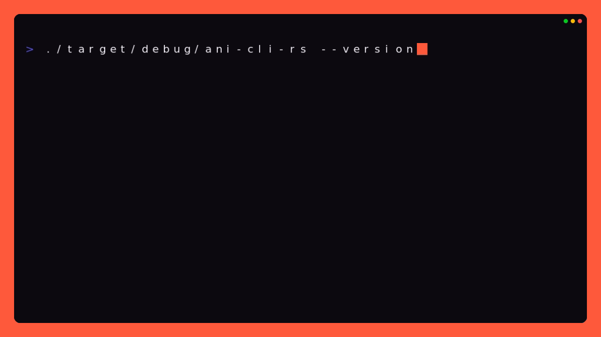

# ani-cli-rs

A cross-platform Rust port of [ani-cli](https://github.com/pystardust/ani-cli) with two independent Anikoto catalogs and native MegaPlay/KotoCDN playback.

`ani-cli-rs` provides the familiar interactive ani-cli experience on Windows, Linux, macOS, and Termux while keeping its executable name distinct from the Bash project. It also exposes the scraper as an `ani_cli` Rust library.



## Quick links

- [Install](#installation)
- [Quick start](#quick-start)
- [Requirements](#requirements)
- [CLI compatibility](#cli-compatibility)
- [Scriptable commands](#scriptable-commands)
- [Build and test](#build-and-test)
- [Showcase generator](showcase/README.md)
- [Troubleshooting](https://github.com/vorlie/ani-cli-rs/wiki/Troubleshooting)
- [Complete documentation](https://github.com/vorlie/ani-cli-rs/wiki)
- [Contributing](CONTRIBUTING.md) · [Security](SECURITY.md) · [License](LICENSE)

## Features

- Interactive anime/season and episode selection
- Subbed and dubbed Anikoto API and Anikoto.cz search and playback
- Native MegaPlay source extraction and transparent KotoCDN HLS unwrapping
- mpv, IINA, VLC, Android mpv, and Syncplay support
- Quality selection, episode ranges, history, and continuation
- Preflighted batch downloads with aria2, yt-dlp, FFmpeg, and built-in fallbacks
- Scriptable commands with JSON output
- Native Rust HTTP, HTML parsing, and local HLS relay—no Python, curl, sed, OpenSSL, Botan, or fzf dependency

## Installation

Official releases are provided for Windows x64 and Linux x86-64. macOS and Termux are tested as source builds; Linux ARM64 is source-buildable but is not maintainer-tested. Prebuilt macOS, Android/Termux, and Linux ARM64 binaries are not currently published.

### Linux

```sh
curl -fsSL https://raw.githubusercontent.com/vorlie/ani-cli-rs/master/scripts/install.sh -o install.sh
sh install.sh
rm install.sh
```

### Windows PowerShell

Portable installation:

```powershell
Invoke-WebRequest https://raw.githubusercontent.com/vorlie/ani-cli-rs/master/scripts/install.ps1 -OutFile install.ps1
.\install.ps1
Remove-Item .\install.ps1
```

To use the Inno Setup installer instead:

```powershell
.\install.ps1 -UseSetup
```

The scripts verify release archives against their published SHA-256 checksums and install to the user-local `~/.local/bin` directory by default. See the [installation guide](https://github.com/vorlie/ani-cli-rs/wiki/Installation) for PATH help, custom locations, uninstalling, and source builds.

## Requirements

- Linux and Windows: [mpv](https://mpv.io/) for default playback
- macOS: [IINA](https://iina.io/) for tested out-of-the-box playback (`brew install --cask iina`)
- Termux: the Android [mpv](https://github.com/mpv-android/mpv-android) app; Android VLC is available with `--vlc`
- Optional: VLC or Syncplay for alternate playback
- Optional: [aria2](https://aria2.github.io/) for faster parallel downloads
- Optional: yt-dlp and FFmpeg for HLS downloads, fallbacks, and embedding provider subtitles into MP4 files

Desktop programs must be available through `PATH`. Termux first targets Android player apps through `termux-am-starter`, `termux-am`, or `am`. If that activity bridge is unavailable, ani-cli-rs falls back to `termux-open-url` and Android's default URL handler. See [Playback and Players](https://github.com/vorlie/ani-cli-rs/wiki/Playback-and-Players) and [Downloads](https://github.com/vorlie/ani-cli-rs/wiki/Downloads) for setup details.

## Quick start

Search interactively:

```console
ani-cli-rs "frieren"
```

Common examples:

```console
ani-cli-rs --dub -q 720p "cowboy bebop"
ani-cli-rs -e 2-4 "one piece"
ani-cli-rs --continue
ani-cli-rs --download "anime title"
ani-cli-rs --allow-adult "search query"
ani-cli-rs --provider anikoto2 "black torch"
```

Interactive playback remains open after an episode and offers next, replay, previous, episode-selection, and quality controls. Add `--exit-after-play` to exit immediately instead.

In download mode, search results act as the anime/season picker. All selected episodes are resolved before the first transfer begins, preventing unavailable episodes from leaving a partially downloaded batch.

## CLI compatibility

The primary interface follows Bash ani-cli conventions:

```text
ani-cli-rs [OPTIONS] [QUERY]
```

Supported compatibility flags include:

```text
-c, --continue            Continue from history
-d, --download            Download instead of play
-D, --delete              Delete history
-s, --syncplay            Use Syncplay
-S, --select-nth          Select the nth search result
-q, --quality             best, worst, or a resolution
-v, --vlc                 Use VLC
-e, --episode             Episode or range
-r, --range               Episode range alias
-a, --allow-adult         Include adult results
-N, --nextep-countdown    Show release timing
-U, --update              Update from GitHub Releases
-p, --provider            anikoto (default) or anikoto2
    --dub                  Use dubbed results
    --multi-selection      Select multiple episodes
    --no-detach            Keep the player attached
    --exit-after-play      Skip the post-playback menu
```

Run `ani-cli-rs --help` for the authoritative list. Environment variables and keyboard controls are documented in the [CLI reference](https://github.com/vorlie/ani-cli-rs/wiki/CLI-Reference).

## Scriptable commands

```console
ani-cli-rs search --json "frieren"
ani-cli-rs -p anikoto2 search --json "black torch"
ani-cli-rs episodes --json SHOW_ID --mode sub
ani-cli-rs links --json SHOW_ID 1 --quality 1080p
ani-cli-rs play SHOW_ID 1 --title "Frieren" --no-detach
ani-cli-rs download SHOW_ID 1 --output ./downloads
ani-cli-rs update --check
```

`episodes`, `links`, `play`, and `download` require the **show ID returned by `search`**, not an anime title.

Anikoto API results have IDs beginning with `anikoto:`. Anikoto.cz results begin with `anikoto2:`. Both prefixes route automatically, including history entries. Raw numeric Anikoto API IDs require `--provider anikoto`; raw Anikoto.cz slugs require `--provider anikoto2`.

Use `ani-cli-rs --download "anime title"` when you want interactive name, season, and episode selection.

Set `ANI_CLI_PROVIDER=anikoto2` to make Anikoto.cz the interactive/search default. The catalogs are intentionally not combined and playback never silently crosses between them.

See the [CLI reference](https://github.com/vorlie/ani-cli-rs/wiki/CLI-Reference) for every command and JSON workflow.

## Security and antivirus notices

Official Windows binaries are currently unsigned and may trigger SmartScreen or heuristic antivirus warnings. ani-cli-rs performs network requests, starts media players/downloaders, and temporarily binds a loopback HLS relay for KotoCDN playback; those behaviors can produce misleading automated behavior classifications.

Release installers verify published checksums. Users who prefer not to run prebuilt binaries can inspect the tagged source and build it with `cargo build --release --locked`. Read [Security and Privacy](https://github.com/vorlie/ani-cli-rs/wiki/Security-and-Privacy) for the full explanation and manual verification steps.

## Build and test

The project uses Rust 2024 and therefore requires a current stable Rust toolchain.

```console
cargo build --release
cargo fmt --check
cargo check --all-targets
cargo clippy --all-targets -- -D warnings
cargo test
```

On Windows with WSL available, `.\showcase\showcase.ps1` generates the deterministic terminal MP4, screenshots, and README GIF without contacting anime providers. See the [showcase guide](showcase/README.md).

Target-specific Cargo aliases and release packaging are covered in [Building and Releasing](https://github.com/vorlie/ani-cli-rs/wiki/Building-and-Releasing).

## Documentation

The [project Wiki](https://github.com/vorlie/ani-cli-rs/wiki) contains the full user and contributor documentation. Its source is tracked in [`wiki/`](wiki/Home.md) so documentation changes can be reviewed with code changes.

Provider internals are documented in [`docs/ANIKOTO-KOTOCDN.md`](docs/ANIKOTO-KOTOCDN.md) and [`docs/ANIKOTO-CZ.md`](docs/ANIKOTO-CZ.md).

## Scope

This project targets Windows, Linux, tested macOS source builds, and tested Termux source builds. iSH adapters, rofi/dmenu integration, intro skipping, and system-journal logging are not currently included.

## License

Licensed under [GPL-3.0-only](LICENSE).
